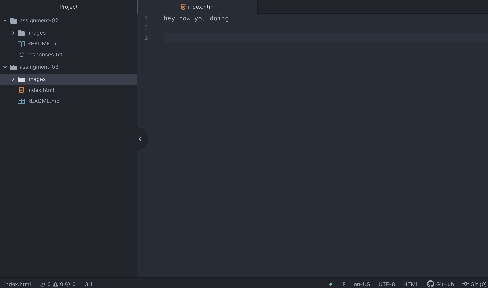

# assignment-03
A browser is a software application used to locate, retrieve and display content
on the World Wide Web, including Web pages, images, video and other files.

I use Safari to surf the web.

A markup language is a computer language that uses tags to define elements
within a document. HTML is the most used markup language.

